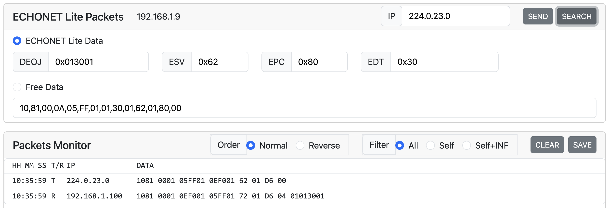
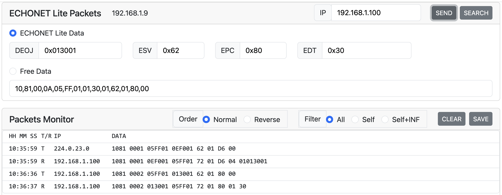

# Readme: SSNG for Node.js

## Revision history

Date| Version | Description
:---|:---|:---|
2018.07.17|1.0.0|First official release
2025.09.09|2.0.0|- Refactoring for dev environment updates</br>- Fixed a bug "received packets of SET_RES is not displayed at Packts Monitor"</br>- Modified options of a filter function.
2025.09.24|2.0.1|updated a script "start" in package.json

## Abstract

- `Japanese:` SSNG for Node.jsは、ECHONET Liteコマンド送受信ツールである。  
- `English:` SSNG for Node.js is a tool to send and receive ECHONET Lite command.

## Requirements

- `Japanese:` Node.jsがインストールされたWindows PC, Macまたは Raspberry Pi  
- `English:` Windows PC, Macintosh or Raspberry Pi on which Node.js is installed.

## Installation

`Japanese`

1. プログラムのファイルを適当なフォルダにコピーする
2. ターミナルを起動、上記のフォルダーに移動し、"npm i" を実行する
3. "npm run build" を実行する

`English`

1. Copy program files to an appropriate folder
2. Launch a terminal program, move to the folder and execute "npm i".
3. Execute "npm run build".

## Launch

`Japanese`

1. ターミナルで "npm start" を実行する
2. Web Browserを起動し、localhost:3000 をアクセスする  
3. SSNGのGUIが表示される (Fig. 1)

`English`

1. execute "npm start" on the terminal program
2. Launch a Web Browser and access localhost:3000
3. GUI of SSNG is displayed (Fig. 1)  


## How to use

### 機器探索 / Search devices

`Japanese`

- SEARCH ボタンをクリックする
- Packets Monitorに送受信したデータが表示される
  - T/R欄の値は、T:送信データ、R:受信データ を示す
  - 受信データの IPアドレスは、送信元の IPアドレスである
  - DATA欄の値は、ECHONET Liteの各要素毎にスペースが挿入されている
  - 受信データの右端の塊はEDTである。
    - 以下の例では、家庭用エアコン(EOJ:0x0130)が１台あることを示している。

`English`

- Click SEARCH Button
- Sent or received data is displayed at Packets Monitor
  - The value in the T/R column shows that "T" is sent data、"R" is received data
  - The value in the IP column of the received data shows source IP address
  - The value in the data column is sent or received data with a space between ECHONET Lite elements
  - The las block of the received data is EDT
    - A following example shows that there is a "home air-conditioner" (EOJ:0x0130)



### EL packet 送信(パラメータ入力) / Send EL packet(Input parameters)

`Japanese`

- IP, DEOJ, ESV, EPC, EDT を入力する
  - ESVが 0x62 (GET) の場合、SSNGはEDTに入力された値を無視する
  - EDTが２バイト以上の場合は、値を 0xAA33FF のような形式で入力する
- SEND ボタンをクリックする

`English`

- Input IP, DEOJ, ESV, EPC, EDT
  - In case ESV is 0x62 (GET), SSNG ignores the value at EDT
  - In case EDT is multibytes data, input data with the format like this, 0xAA33FF
- Click SEND Button



### EL packet 送信(バイナリデータ入力) / Send EL packet(Input binary data)

`Japanese`

- ラジオボタン "Free Data" をクリックする
- バイナリデータを入力する
- SEND ボタンをクリックする

`English`

- Click radio button "Free Data"
- Input binary data
- Click SEND Button


### 受信データ解析 / Analyze received data

`Japanese`

- Packets Monitorの受信データを選択する
- 解析したEDTデータを最下部に表示する
  - 現状では、EPC:9D, 9E, 9F の場合のプロパティマップのみ解析して表示する

`English`

- Select received data at Packets Monitor
- Analyzed EDT data is displayed at the bottom of the Packets Monitor
  - For now, only property map data of EPC:9D, 9E and 9F is analyzed


### GET, INFを受信した場合 / In case of receiving GET, INF

`Japanese`

- 他の機器からGETコマンドを受信した場合、SSNGは適切なGET_RESコマンドを返信する
  - 受信データおよび送信データをPackets Monitorに表示する
- 他の機器からINFコマンドを受信した場合、SSNGはなにも反応しない
  - 受信データをPackets Monitorに表示する

`English`

- In case SSNG receives GET command, it will respond appropriate data by GET_RES command
  - Received and sent data is displayed at Packets Monitor
- In case SSNG receives INF command, it will respond nothing
  - Received data is displayed at Packets Monitor


### Order: Reverse

`Japanese`

- Packets Monitor の Reverse ボタンをクリックすると、ログ表示の時間方向が逆転する

`English`

- In case Reverse button at the Packets Monitor is clicked, time order of the logs is reversed


### Filter: Self

`Japanese`

- Packets Monitor の Self ボタンをクリックすると、SSNGが送信したパケットと、そのレスポンスパケットのみ表示する

`English`

- In case Self button at the Packets Monitor is clicked, only the data that SSNG sent and its response is displayed.


### Filter: Self+INF

`Japanese`

- Packets Monitor の Self+INFボタンをクリックすると、Selfボタンのデータおよび受信したINFパケットのみ表示する

`English`

- In case Self+INF button at the Packets Monitor is clicked, the data with Self button and received INF packet are displayed.


### Clear Packets Monitor

`Japanese`

- Packets Monitor の Clear ボタンをクリックすると、Packets Monitorの表示をクリアする

`English`

- In case Clear button at the Packets Monitor is clicked, Packets Monitor is cleared.


### ログデータの保存 / Save Log data

`Japanese`

- Packets Monitor の SAVE ボタンをクリックすると、ログデータを"log"フォルダに保存する

`English`

- In case SAVE button at the Packets Monitor is clicked, log data is saved in the "log" folder.

## 開発関連情報

### Background of this version

Filter の仕様を変更しようとしたところ、Node.jsのバージョンアップによるmodule仕様の変更や、フロントエンドのフレームワークであるVue.jsのバージョンが2から3になったことに伴うAPI仕様の変更（Options APIからComposition API）などがあり、本格的なリファクタリングが必要となった。今回のバージョンを 2.0.0 とする。

### 依存モジュール

`Server side`

- express: web server
- ws: web socket server

`Front end`

- vue.js
- bootstrap

`開発`

- vite

### プログラムの構成

同一PC内にサーバーとクライアントが存在し、アプリケーションの機能を実現する。クライアントはWeb Application。サーバー側はブラウザーで実行できない機能を実現する。

#### サーバー

- Node.js のアプリケーション
- Web server機能
  - クライアントへサービス（UDPの送信依頼）機能をRESTのAPIで提供
  - クライアントのWebアプリをホストするため
- ECHONET Lite のコントローラ機能（UDPの送受信など）
- ログファイルの保存機能
- ローカルPCのIP address取得
- Web socketを使って、ECHONET Liteの送受信データをクライアントにPUSH送信する

#### クライアント

- HTML/CSS/JavaScriptで実現するWebアプリケーション
- フレームワークとして Vue.js と bootstrap を利用
- 開発環境としてviteを利用

#### ディレクトリ構成

```
.
├── app.js // サーバーサイドのNode.jsプログラム
├── dist   // クライアントがWebアプリをダウンロードするdirectory
│   ├── assets
│   │   ├── index-CtSzg3Gq.css
│   │   └── index-DJwN2yU3.js
│   ├── favicon.ico
│   └── index.html
├── index.html // フロントエンドアプリのソース
├── jsconfig.json
├── package-lock.json
├── package.json
├── public
│   └── favicon.ico
├── README.md
├── src       // フロントエンドアプリのソース
│   ├── App.vue
│   ├── assets
│   │   ├── base.css
│   │   ├── logo.svg
│   │   └── main.css
│   ├── components
│   │   ├── Ssng2.vue
│   └── main.js
├── ssng-node2.code-workspace
└── vite.config.js
```

#### プログラム修正時の作業方法

1. module のインストール

```
npm i
```

2. サーバーサイドのプログラム修正

- app.js を編集する

3. フロントエンド（クライアント）アプリのソース修正

- src/Ssng.2vue を修正する
- ターミナルで "npm run build" を実行する
  - dist directoryに html, css, js fileが作成される
- ターミナルで "npm start" を実行するとプログラムが起動する
- ブラウザで localhost:3000 をアクセスするとUIが表示される
